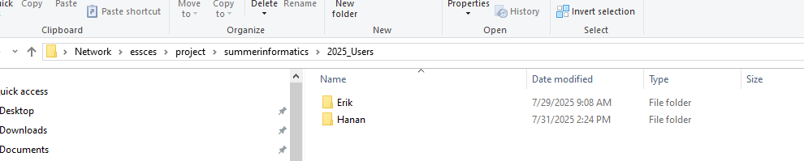

# Introduction to Accessing MHH-HPC

## 🧠 Background

**High-Performance Computing (HPC)** refers to the use of supercomputers and parallel processing techniques to solve complex computational problems at high speeds. At MHH, the HPC environment supports large-scale data analysis, modeling, and bioinformatics workflows.

---

## 📊 HPC System Overview

The diagram below shows how the HPC system is structured, including login nodes, compute nodes, and shared storage:

## HPC Diagram
<p align="center">
  
</p>

---

## 📁 Directory Structure on HPC

The HPC system organizes user files under a shared project directory. This structure ensures a clean and manageable workspace for each user.


## HPC Structure
<p align="center">
  
</p>

---


--

## 💻 Accessing HPC from Your Local Machine

You can transfer files between your local computer and the HPC system using the network path below:

### 📂 Steps to Access Shared Folder:
1. Open **File Explorer** on your Windows computer.
2. In the address bar, type: ``` \\essces ```
3. Press **Enter**.
4. Navigate through the following folders: - `project` - `summerinformatics` - `2025_Users`
5. Create your personal folder using your name (e.g., `Hanan`, `Erik`, etc.).

## HPC Local Accessing
<p align="center">
  
</p>

---


 ## 🧪 Activating Compute Node & Launching RStudio To use computing power (cores, memory) for analysis,
  you'll need to **activate a compute node** and launch **RStudio** via the web interface.
  ### 📝 Steps to Start an R Session on HPC ####
  🔗 Step 1: Login to the HPC Web Portal
  1. Open your browser and go to: ``` https://leineood.mh-hannover.local/ ```
  2. Enter your **MHH username and password** (same as your hospital/work PC login).

  ## Launching RStudio
  <p align="center">
    
  </p>

  ---


  #### 🧠 Step 2: Launch RStudio Session
   1. Click on: - **CPU – Software** - Then select **RStudio - Advanced**

   ##  RStudio Session
   <p align="center">
     
   </p>

   ---
   #### ⚙️ Step 3: Configure Your Job Settings On the job submission page, fill in the following details:
   - **Container Path**: ``` /hpc/project/summerinformatics/environments/summerinformatics_RStudio.sif ```
    - **Password**: Choose a temporary session password, e.g., `123`
    - **Cores**: `4`
    - **Memory (MB)**: `16000`
    - **Job Time (hours)**: `8`
    - **Reservation**: `XXX` *(if applicable; otherwise leave it blank)* Leave all other fields as default.
    Then click **Launch** to start your RStudio session.

    ##  RStudio Launch
    <p align="center">
      
    </p>

   ---
   - **Wait**: Click on Connect to Rstudio Server

   ##  RStudio Server
   <p align="center">
     
   </p>
  ---
  - **insert** 123 password and do not save that, Then click
##  RStudio active
  <p align="center">
    
  </p>
  ---
#### ⚙️ Step 4: we you are done, you have to terminate your job by click Cancel.     

##  RStudio end job
<p align="center">
  
</p>
---


## 🧠 Contributors

- **Contact:** hananalbegali@gmail.com


## 📁 Repository Structure
